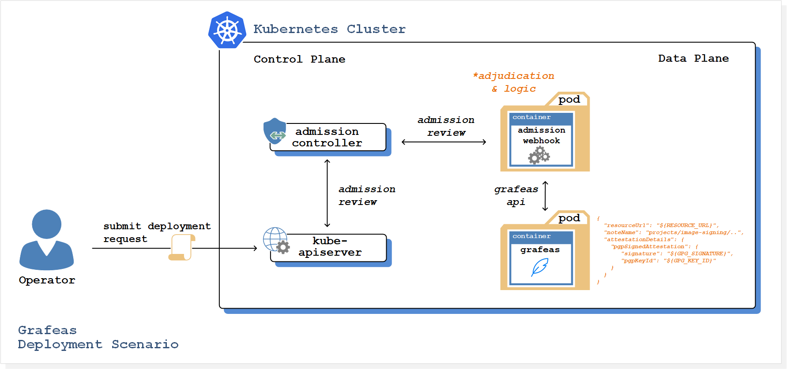

[grafeas]:[https://grafeas.io/]
[oci]:[https://cloud.oracle.com/en_US/cloud-infrastructure]
[oke]:[https://cloud.oracle.com/containers/kubernetes-engine]
[oci-signup]:[https://cloud.oracle.com/tryit]
[kubectl]:[https://kubernetes.io/docs/tasks/tools/install-kubectl/]

# Running Grafeas on [Oracle OKE][oke] (Container Engine for Kubernetes)

## Introduction
Welcome to our introduction to [Grafeas][grafeas]! In this article, we'll show you how to get up and running with Grafeas.

First we will introduce you to Grafeas, an open artifact metadata API designed to help audit and govern your software supply chain. Then we will take you through a Grafeas deplyment scenario on [Oracle Container Engine for Kubernetes (OKE)][oke], whereby a Kubernetes validating admission controller is configured to integrate with Grafeas - providing a mechanism to make real-time, policy-based decisioning about whether pods are authorised to run on the cluster.

## About [Grafeas][grafeas]
At each stage of the software supply chain (code, build, test, deploy, and operate), different tools generate metadata about various software components. Examples include the identity of the developer, when the code was checked in and built, what vulnerabilities were detected, what tests were passed or failed, and so on. Grafeas’ goal is to provide the infrastructure to store and manage this metadata about artifacts associated with the software supply chain.

Grafeas (Greek word for “scribe”) provides organizations with a central source of truth for the tracking and enforcing of policies across software development teams and pipelines. The intention is that build, auditing and compliance tools can use the Grafeas API to store, query and retrieve metadata around a wide array of artifacts and components associated with the software development and deployment life cycle.

Tracking Grafeas’ metadata can give you confidence about what containers are in your environment, and also provides the ability to enforce restrictions on which containers get deployed. Deployment tooling can be configured to review Grafeas metadata for compliance with your policies before deploying.
Grafeas can be used to enforce a wide variety of security policies. For example, you can configure policies to block container images with vulnerabilities from being deployed, and ensure that deployed images are built from a base image explicitly sanctioned by your security team, or to require that images go through your build pipeline.

Grafeas divides the metadata information into [notes](https://github.com/grafeas/grafeas#notes) and [occurrences](https://github.com/grafeas/grafeas#occurrences). Notes are high-level descriptions of particular types of metadata. Occurrences are instantiations of notes, which describe how and when a given note occurs on the resource associated with the occurrence. This division allows for fine-grained access control of different types of metadata.

## Tutorial Overview
Let’s consider an example of how Grafeas can provide deploy-time control for a sample MySQL implementation using a demonstration verification pipeline.

This example will use the docker.io/mysql/mysql-server:8.0.12 container for testing. We assume that you (as the QA engineer) want to create an attestation within Grafeas that will certify this image as safe for production usage. Only this image will run on our cluster, requests to create pods based on any other image that has not been approved will be rejected by the Kubernetes control plane.



The Grafeas deployment scenario illustration describes the verification pipeline that will be implemented into our cluster:
 - A validating admission controller is configured via specific rules to intercept all pod creation requests to the Kubernetes API server, which occurs prior to persistence of the requested object.
 - Once initiated, the admission controller is configured to call a validating admission webhook, which is responsible for checking with the Grafeas API whether our image is authorised to run (admission webhooks are HTTP callbacks that receive admission requests and do something with them).

Grafeas uses kind-specific schemas, such that each kind of metadata information adheres to a strict schema. In our Grafeas deployment we will be referncing metadata using the Grafeas kind `ATTESTATION`, which will certify that the MySQL image complies with our deployment policy requirements. By using the validating admission webhook, we are able to check at runtime for the expected Grafeas attestations, and block deployment when they aren’t present.

_Note: It is suggested that this tutorial only be implemented into a non mission-critical environment. The deployment scenario will prevent all pods from running, apart from only those explicitly configured with the appropriate attestations within the Grafeas deployment._

### Prerequisites
 - You will need to have deployed your OKE Kubernetes cluster before commencing to implement the deployment scenario. Follow the link to [this tutorial](https://www.oracle.com/webfolder/technetwork/tutorials/obe/oci/oke-full/index.html) for guidance on the process.
 - Create a `kubeconfig` authentication artefact. This will be used later in the tutorial to connect to the Grafeas server. Follow the link to [this tutorial](https://www.oracle.com/webfolder/technetwork/tutorials/obe/oci/oke-full/index.html#DownloadthekubeconfigFilefortheCluster) for guidance on the process.
 - Kubernetes admission controllers need to be enabled. Since we are running Kubernetes on OKE, our required admission controllers are automatically enabled. OKE implements the [recommended set of admission controllers](https://kubernetes.io/docs/reference/access-authn-authz/admission-controllers/#is-there-a-recommended-set-of-admission-controllers-to-use) for a given Kubernetes cluster version.

### Clone the oke-grafeas-tutorial repository
Clone the oke-grafeas-tutorial repository:

``` bash
git clone https://github.com/oracle/cloudnative/security/oke-grafeas-tutorial.git
```

Commands from this point forward will assume that you are in the `oke-grafeas-tutorial` directory.

### Deploy Grafeas server
Run the following command to deploy your Grafeas server:

``` bash
kubectl apply -f kubernetes/grafeas.yaml
```

In our demonstration we are using a pre-built Grafeas image based on the [example Grafeas server](https://github.com/Grafeas/Grafeas/tree/master/samples/server/go-server/api/server).
_The demonstration Grafeas deployment is configured as a light-weight implementation, with configuration data as ephemeral only. As such, configuration data will not persist across restarts._

### Generate GPG (GnuPG) keys
Next we generate a [GPG](https://www.gnupg.org/gph/en/manual.html#INTRO) keypair that will be used to sign our container image metadata. We'll then retrieve the id of the image signing key.

Assuming gpg is installed on your system, run the following command to generate a signing key:

``` bash
gpg --batch --gen-key pki/gpg.keygen
```

Now issue the following command to retreive the ID of the gpg signing key created in the previous step:

``` bash
gpg --list-keys --keyid-format short
```

The output from the gpg --list-keys command contains the key ID:

``` bash
----------------------------
pub   2048R/89BEA918 2018-09-15
uid   signatory (example key signatory) <signatory@example.com>
sub   2048R/B5B42C98 2018-09-15
```

The key ID in the above output example is `89BEA918`. Take note of the unique key output generated in your shell session, and store it in the GPG_KEY_ID environment variable as follows:

``` bash
export GPG_KEY_ID=89BEA918
```

Docker uses a content-addressable image store. The image ID is a SHA256 digest covering each of the images layers. We will utilise the image ID as our unique identifier for the specific image that will be explicitly permitted to run on our cluster.

We will be using the mysql/mysql-server:8.0.12 container image as our example white-listed resource. Run the following commands to sign a text file containing the image digest for mysql/mysql-server:8.0.12 using gpg:

``` bash
### ### ###
# Create our mysql-image-digest.txt file..
### ### ###
cat >mysql-image-digest.txt <<EOF
sha256:58c5d4635ab6c6ec23b542a274b9881dca62de19c793a8b8227a830a83bdbbdd
EOF
### ### ###
# Sign the file..
### ### ###
gpg -u signatory@example.com \
  --armor \
  --clearsign \
  --output=mysql-signature.gpg \
  mysql-image-digest.txt
### ### ###
# Verify the signature..
### ### ###
gpg --output - --verify mysql-signature.gpg
```

The output signature verification should be similar to the following:

``` bash
gpg: Signature made Sat 15 Sep 2018 08:48:40 AM UTC using RSA key ID 89BEA918
gpg: Good signature from "signatory (example key signatory) <signatory@example.com>"
```

In order for others to verify signed images - they must both trust, and have access to the image signer's public key. Run the following command to export the image signer's public key:

``` bash
gpg --armor --export signatory@example.com > ${GPG_KEY_ID}.pub
```

### Create Grafeas objects
Now that we have a signed container image and a public key for verification, we can go ahead and create a Grafeas attestationAuthority note, and an associated pgpSignedAttestation occurrence using the Grafeas API. The pgpSignedAttestation occurrence is used to make statements about suitability for a deployment.

First, create a secure tunnel to the Grafeas API endpoint inside your cluster:

``` bash
kubectl port-forward \
  $(kubectl get pods -l app=grafeas -o jsonpath='{.items[0].metadata.name}') \
  8080:8080
```

#### Create Grafeas production project
Let's create a Grafeas project which will then contain our note & associated occurrence:

``` bash
curl -v -X POST http://localhost:8080/v1alpha1/projects \
  -H 'Content-Type: application/json' \
  -d '{"name": "projects/image-signing"}'
```

#### Create Grafeas attestationAuthority note
Then run the following commands to create the production attestationAuthority note:

``` bash
### ### ###
# Define the attestationAuthority Note content..
### ### ###
cat >prod-note.json <<EOF
{
  "name": "projects/image-signing/notes/production",
  "shortDescription": "Production image signer",
  "longDescription": "Production image signer",
  "kind": "ATTESTATION_AUTHORITY",
  "attestationAuthority": {
    "hint": {
      "humanReadableName": "production"
    }
  }
}
EOF
### ### ###
# Post the production attestationAuthority content..
### ### ###
curl -X POST \
  "http://localhost:8080/v1alpha1/projects/image-signing/notes?noteId=production" \
  -d @prod-note.json
```

#### Create Grafeas pgpSignedAttestation occurrence
Now that the project and note have been created, we can create a pgpSignedAttestation occurrence referencing our production note:

``` bash
### ### ###
# Define GPG_SIGNATURE & RESOURCE_URL environment variables..
### ### ###
export GPG_SIGNATURE=$(cat mysql-signature.gpg | base64)
export RESOURCE_URL="https://docker.io/mysql/mysql-server@sha256:58c5d4635ab6c6ec23b542a274b9881dca62de19c793a8b8227a830a83bdbbdd"
### ### ###
# Define the pgpSignedAttestation Occurrance content..
### ### ###
cat > prod-occurrence.json <<EOF
{
  "resourceUrl": "${RESOURCE_URL}",
  "noteName": "projects/image-signing/notes/production",
  "attestationDetails": {
    "pgpSignedAttestation": {
       "signature": "${GPG_SIGNATURE}",
       "pgpKeyId": "${GPG_KEY_ID}"
    }
  }
}
EOF
### ### ###
# Post the pgpSignedAttestation content..
### ### ###
curl -X POST \
  'http://127.0.0.1:8080/v1alpha1/projects/image-signing/occurrences' \
  -d @prod-occurrence.json
```

At this point the Grafeas configuration is complete, and the hub.docker.com/r/mysql/mysql-server v8.0.12 image can be verified through the Grafeas API.

With the configuration that is currently in place - only the hub.docker.com/r/mysql/mysql-server v8.0.12 image identified by the sha256:58c5d4635ab6c6ec23b542a274b9881dca62de19c793a8b8227a830a83bdbbdd image digest can be verified by the Grafeas API. Authorisation of additional images would require a new Grafeas occurrence.

### Kubernetes configuration
Next we will go ahead and create the Kubernetes Validating Admission Controller, and deploy our Validating Admission Webhook.

#### Deploy the Image Signature Webhook to Kubernetes
Run the following command to create the image-signature-webhook configmap, and store the image signer's public key:

``` bash
kubectl create configmap image-signature-webhook \
  --from-file ${GPG_KEY_ID}.pub
```

Next we create the tls-image-signature-webhook secret, and store the TLS certificates:

``` bash
kubectl create secret tls tls-image-signature-webhook \
  --cert=pki/image-signature-webhook.pem \
  --key=pki/image-signature-webhook-key.pem
```

Now create the image-signature-webhook deployment, and image-signature-webook ValidatingWebhookConfiguration:

``` bash
kubectl apply -f kubernetes/image-signature-webhook.yaml
kubectl apply -f kubernetes/validating-webhook-configuration.yaml
```

At this point the Grafeas and Kubernetes configurations are complete. Requests to create pods in the cluster will now be intercepted by the validating admission controller.

### Testing the Admission Controller and Webhook
First we attempt to run the oracle/nosql:4.3.11 container image, which doesn't have a pgpSignedAttestation occurrence in the Grafeas metadata repository. Attempt to create the pod:

``` bash
kubectl apply -f kubernetes/pod/nosql-server-4.3.11.yaml
```
Notice the nosql-server pod was not created, and the following error was returned:

``` bash
The  "" is invalid: : No matched signatures for container image: docker.io/oracle/nosql:4.3.11
```

The nosql-server pod wasn't created because the oracle/nosql:4.3.11 container image was not verified by the image signature webhook. No related pgpSignedAttestation occurrence exists in the Grafeas metadata repository.

Now attempt to run the docker.io/mysql/mysql-server@sha256:58c5d4635ab6c6ec23b542a274b9881dca62de19c793a8b8227a830a83bdbbdd container image - which does have a pgpSignedAttestation occurrence in the Grafeas metadata repository:

``` bash
kubectl apply -f kubernetes/pod/mysql-server-8.0.12.yaml
```

Now we receive a more familiar, succesful response:

``` bash
pod "mysql-server" created
```

At this point you should now have the following pods running in your cluster:

```
kubectl get pods
NAME                                       READY     STATUS    RESTARTS   AGE
grafeas-7554b6bffd-6gsfq                   1/1       Running   0          58m
image-signature-webhook-6fd49f765f-8h9z9   1/1       Running   0          30m
mysql-server                               1/1       Running   0          30s
```

### Logging
To attach to your image-signature-webhook pod and get access to more detailed logging, refer to the logging section in the following [instruction](image-signature-webhook/README.md).

### Tidy Up
Run the following commands to remove the Kubernetes resources created during this tutorial:

```
kubectl delete deployments grafeas image-signature-webhook
kubectl delete pods mysql-server
kubectl delete svc grafeas image-signature-webhook
kubectl delete secrets tls-image-signature-webhook
kubectl delete configmap image-signature-webhook
```

## Conclusion
Tracking Grafeas' metadata allows a team to understand what containers are stored within the environment, and also to enforce restrictions on which containers get deployed.
This central store of metadata promises to provide a whole new layer of visibility into the software supply chain — and to enhance auditing and governance capabilities.